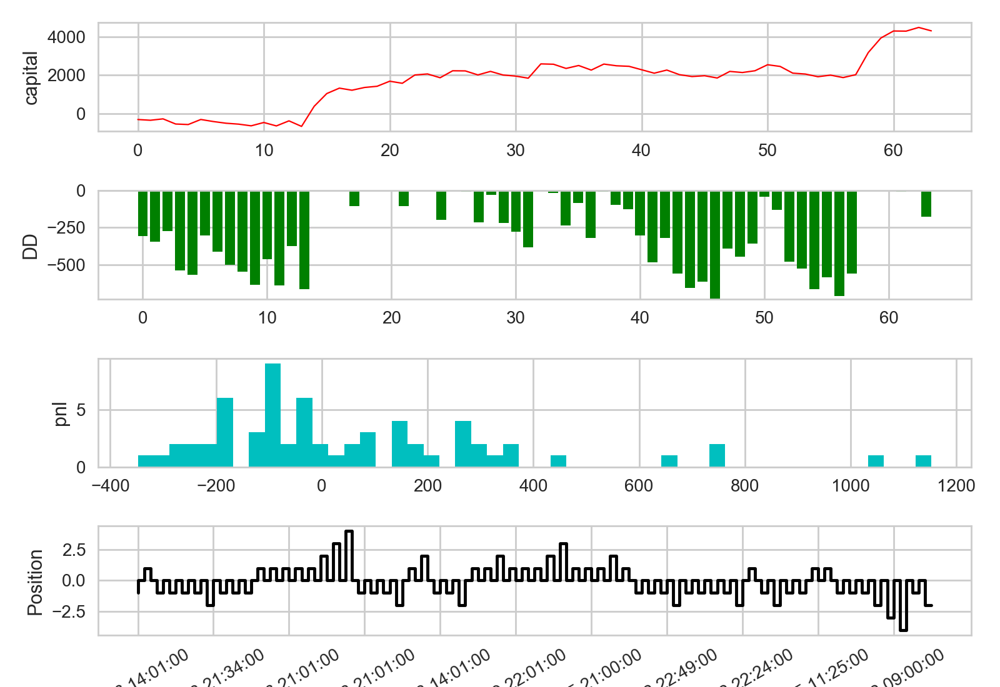
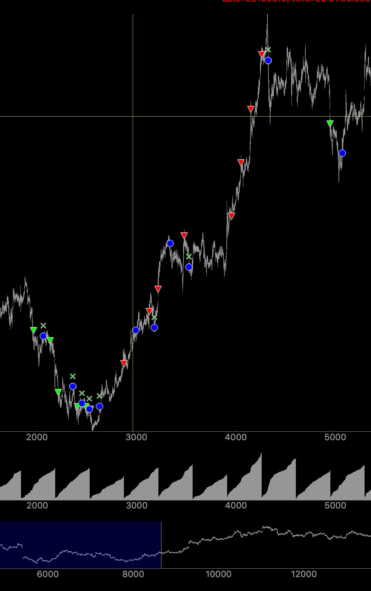
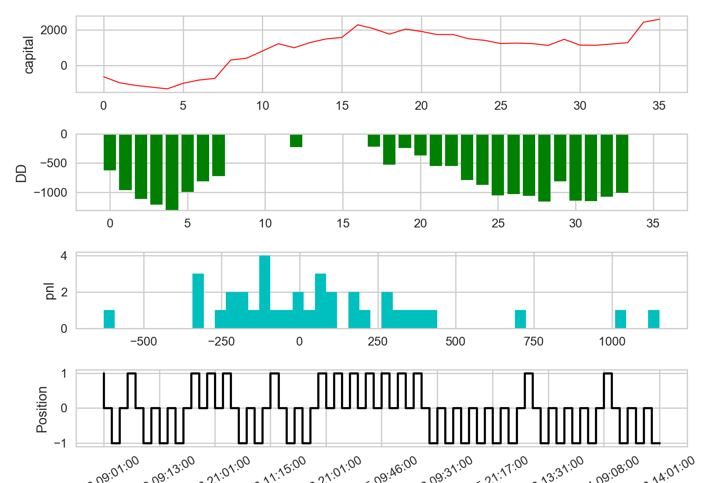

# strategy_report_daybreak
日内突破策略回测

## RB回测
python3 ../backtest.py -m B -d 100 -sf CTA_setting_RSIDayBreakPlus.json  -s rb1910

### 12分钟级别 加仓策略


<center>




```
--------------------------------------------------
                 0                    1
0       第一笔交易  2019-05-06 14:18:00
1     最后一笔交易  2019-08-06 22:57:00
2       总交易次数                   64
3     多头交易次数                   27
4     空头交易次数                   37
5         期末净值                 1.04
6           总盈亏             4,297.22
7       年化收益率                 0.17
8       收益回撤比               -23.53
9         最大回撤              -732.44
10  最大回撤百分比                -0.01
11    平均每笔盈利                67.14
12    平均每笔滑点                 20.0
13    平均每笔佣金                  7.7
14            胜率                43.75
15  盈利交易平均值               325.16
16  亏损交易平均值              -133.53
17          盈亏比                 2.44
18    多仓平均利润                95.21
19    空仓平均利润                46.67
计算按日统计结果
--------------------------------------------------
                   0            1
0       首个交易日：   2019-04-30
1       最后交易日：   2019-08-07
2         总交易日：           61
3         盈利交易日           23
4       亏损交易日：           21
5         起始资金：       100000
6         结束资金：   104,297.22
7         总收益率：          4.3
8         年化收益：        16.91
9           总盈亏：     4,297.22
10        最大回撤:       -664.15
11  百分比最大回撤:         -0.66
12        总手续费：       492.78
13          总滑点：        1,280
14      总成交金额：  4,927,850.0
15      总成交笔数：          110
16        日均盈亏：        70.45
17      日均手续费：         8.08
18        日均滑点：        20.98
19    日均成交金额：    80,784.43
20    日均成交笔数：          1.8
21      日均收益率：         0.07
22      收益标准差：         0.35
23    Sharpe Ratio：         3.02
```




局部开仓

</center>


### 30分钟级别 不加仓策略

<center>




```
--------------------------------------------------
                 0                    1
0       第一笔交易  2019-05-06 09:00:00
1     最后一笔交易  2019-08-07 09:01:00
2       总交易次数                   36
3     多头交易次数                   15
4     空头交易次数                   21
5         期末净值                 1.03
6           总盈亏             2,600.91
7       年化收益率                  0.1
8       收益回撤比                 -8.7
9         最大回撤            -1,307.55
10  最大回撤百分比                -0.01
11    平均每笔盈利                72.25
12    平均每笔滑点                 20.0
13    平均每笔佣金                 7.75
14            胜率                52.78
15  盈利交易平均值               312.32
16  亏损交易平均值              -196.07
17          盈亏比                 1.59
18    多仓平均利润               107.57
19    空仓平均利润                47.02
计算按日统计结果
--------------------------------------------------
                   0            1
0       首个交易日：   2019-04-30
1       最后交易日：   2019-08-07
2         总交易日：           61
3         盈利交易日           26
4       亏损交易日：           21
5         起始资金：       100000
6         结束资金：   102,600.91
7         总收益率：          2.6
8         年化收益：        10.23
9           总盈亏：     2,600.91
10        最大回撤:      -1,276.3
11  百分比最大回撤:         -1.28
12        总手续费：       279.09
13          总滑点：          720
14      总成交金额：  2,790,940.0
15      总成交笔数：           72
16        日均盈亏：        42.64
17      日均手续费：         4.58
18        日均滑点：         11.8
19    日均成交金额：    45,753.11
20    日均成交笔数：         1.18
21      日均收益率：         0.04
22      收益标准差：         0.27
23    Sharpe Ratio：         2.31
--------------------------------------------------
```


</center>